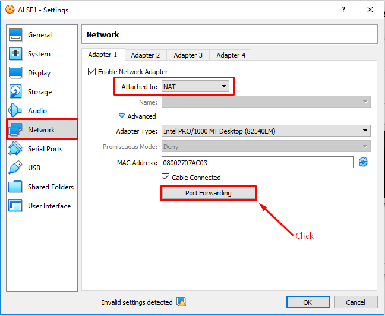
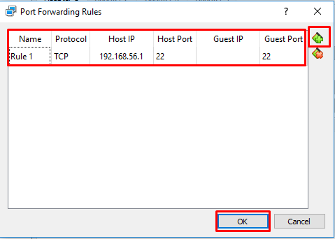

# Configuración de **_Guest_**
- Requisisto: instalación de _guest_
## En VirtualBox

### Configuración de red.
Para permitir la conectividad a internet desde el **_guest_** y al mismo tiempo permitir la comunicación con el **_host_**.

Ir a la configuración de la _máquina virtual_.

  

Seleccionar en la configuración de red la opción NAT para el acceso a internet y luego hacer click en _Port Forwarding_ para configurar la comunicación con el _host_.

  

La configuración de la comunicación con el _host_ se establece a través de la dirección IP de _Host IP_. Ver IP.

  

