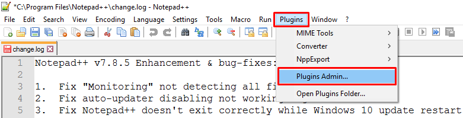
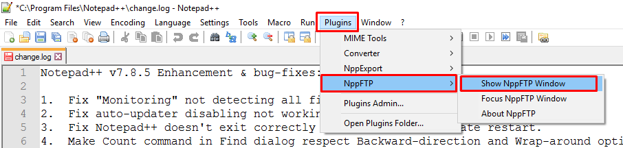
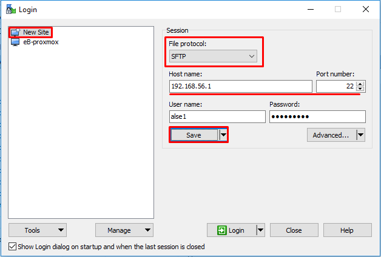
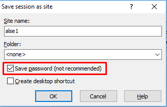
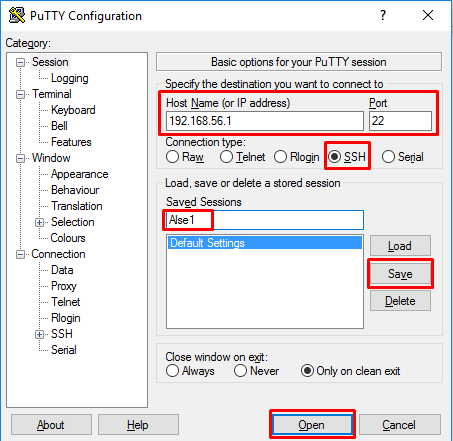

# Configuración de procesos en **_host_**

## En Windows

### 2. Notepad++ NppFTP plugin
-Requisitio: instalación de [Notepad++](https://notepad-plus-plus.org/downloads/)

[NppFTP](https://ashkulz.github.io/NppFTP/) es el _plugin_ que permite la comunicación entre el editor y el _guest_.

En Notepad++ iniciar el administrador de _plugins_

  

Buscar el _plugin_ llamado NppFTP e instalar.

  

Luego de la instalación de NppFTP Notepadd++ se reinicia. Ir al _plugin para mostrar la ventana de configuración.

  

Configurar los parámentors del _guest_ en el plugin NppFTP de Notepad++. Los parámetros pueden variar. Ver [Configuración de guest](comunicacion-host-guest.md) y [Dirección de guest](config-guest.md))

  

  

Conectar Notepad++ al _guest_

  

### 3. Administrador de archivos

-Requisitio: instalación de [WinSCP](https://winscp.net/eng/download.php)

Configurar los parámentors del _guest_ en WinSCP y hacer click en Guardar (Save). Los parámetros pueden variar. Ver [Configuración de guest](comunicacion-host-guest.md) y [Dirección de guest](config-guest.md))

  

Asignar nombre y guardar contraseña

  

### 4. Consola SSH

- Requisito: descarga de [PuTTY](https://www.chiark.greenend.org.uk/~sgtatham/putty/latest.html)

Configurar los parámentors del _guest_ en PuTTY y hacer click en Guardar (Save). Los parámetros pueden variar. Ver [Configuración de guest](comunicacion-host-guest.md) y [Dirección de guest](config-guest.md))

  

