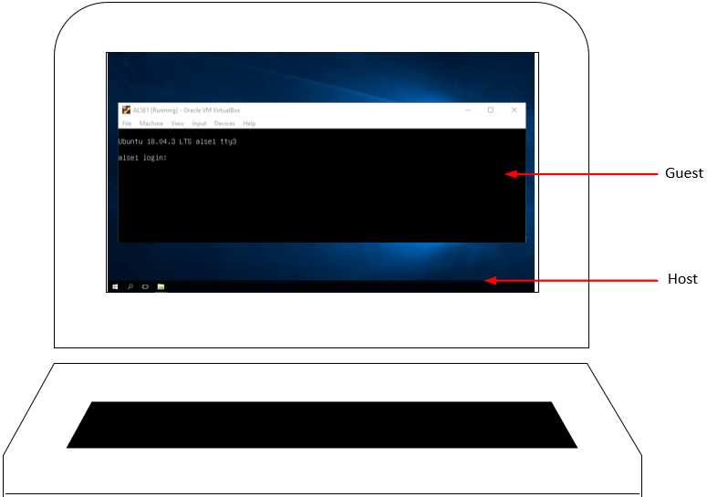
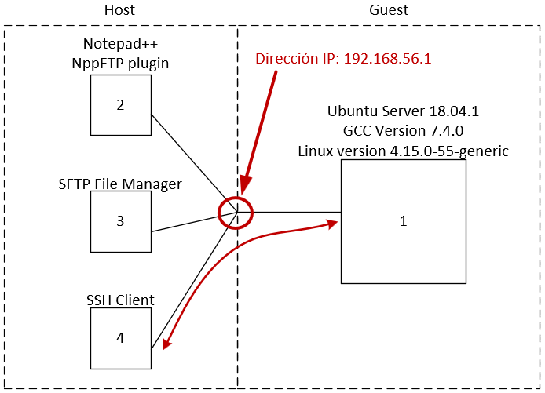
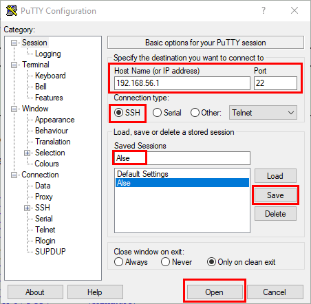

# Conexión a la VM usando SSH y SFTP

## Introducción
Teniendo en cuenta los dos sistemas operativos (OS), uno denominado **_Guest_** (invitado) con Ubuntu y el OS principal **_Host_**, se busca establecer una conexión entre el _Host_ y el _guest_ para la administración del OS Ubuntu y el intercambio de archivos.

  

## Proceso de conexión SSH
La comunicación entre el _host_ y el OS Ubuntu (_guest_) usando SSH, se hace a través del punto de conexión encerrado, usando la dirección IP _192.168.56.1_ como se muestra a continuación.

  

El Cliente SSH desde donde se establece la conexión se llama PuTTY y se puede descargar [aquí][l1] o [aquí][l2]. Este permite el acceso a la interfaz de comandos de línea (Command Line Interface - CLI) del OS ubuntu. Además, permite interacciones básicas entre _host_ y _guest_ como copiar y pegar, entre otras.

[l1]:https://the.earth.li/~sgtatham/putty/latest/w64/putty.exe
[l2]:https://www.chiark.greenend.org.uk/~sgtatham/putty/latest.html

Ingrese los campos mostrados, guarde y luego abra la conexión.

  

