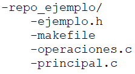
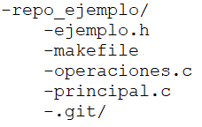
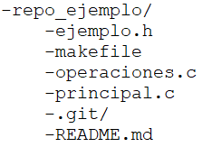

# Git

- What is Git?
  [inglés](https://docs.microsoft.com/en-us/devops/develop/git/what-is-git) - [español](https://docs.microsoft.com/es-mx/devops/develop/git/what-is-git)

- [About Git](https://git-scm.com/about)

> "Git is a free and open source distributed version control system designed to handle everything from small to very large projects with speed and efficiency."
> -- <cite>[Git-Source Control Management](https://git-scm.com/)</cite>


Para el almacenamiento de los repositorios se utiliza **GitHub**. El procedimiento consiste primero en la creación de una cuenta gratuita en [GitHub](https://github.com/)

<p align="center">
  
</p>

Luego de esto, se procede con la creación del repositorio y la ejecución de las tareas de Git (_add_, _commit_ y _push_) desde la interfaz de línea de comandos (CLI).

## Crear un repositiorio nuevo.

Un repositorio de GitHub es una ubicación en la plataforma de GitHub, donde los archivos y códigos se almacenan, administran y se utilizan, de acuerdo con las particularidades en el desarrollo de un proyecto. 

Para crear un repositorio en GitHub, puede seguir [este instructivo](https://docs.github.com/es/repositories/creating-and-managing-repositories/creating-a-new-repository).

## Subir a GitHub desde el CLI

El procedimiento se muestra a partir del siguiente ejemplo. Suponga que ya fue creado el repositorio llamado _repo\_ejemplo_ en GitHub, al cual se le quieren agregar los archivos contenidos en el directorio con el mismo nombre -_repo\_ejemplo_- (repositorio local). La estructura del directorio con sus archivos se muestra a continuación.

<p align="center">
  
</p>

Ubicado en el directorio _repo\_ejemplo_ (utilice el comando _cd_ para cambiar de directorio y para verificar la ubicación el comando _pwd_), ejecute el siguiente comando para inicializar el seguimiento a las modificaciones de los archivos del directorio.
```
git init
```

Con el comando _ls -la_ puede verificar que se genere el directorio _.git_, quedando de la siguiente forma.

<p align="center">
  
</p>

Puede crear un archivo de tipo _Markdown_ (.md) con instrucciones, descripción o manual sobre el proyecto y los archivos contenidos en el repositorio. Generalmente, este tiene nombre _README.md_, y puede ser creado ingresando el siguiente comando:

```
echo "# repositorio de ejemplo 1" >> README.md
```

Con el comando _ls -la_ puede verificar que se genere el archivo _README.md_, quedando de la siguiente forma.

<p align="center">
  
</p>

Agregue a git (_git add_) los archivos que quiere subir al repositorio en GitHub. **Para este ejemplo**, se suben únicamente _ejemplo.h_, _operaciones.c_ y _README.md_

```
git add ejemplo.h operaciones.c README.md
```

* Puede verificar lo anterior con el comando:
	```
	git status
	```

Confirme (_commit_) los archivos a subir, indicando una descripción de los cambios o actualizaciones realizadas sobre los archivos.

```
git commit -m "primer commit"
```

Con los siguientes comandos se define la rama del repositorio donde quedarán los archivos y la URL con el repositiorio en GitHub. Modifique en el URL _usuario_creado_ por el nombre creado en el primer paso de esta guía.

```
git branch -M main
git remote add origin https://github.com/marco-on/repo_ejemplo.git
```

## Autenticación en GitHub

Por último, para subir los archivos se debe autenticar con el usuario y _token_ de su cuenta de GitHub.

Para generar un _Token_, realice el procedimiento de [este enlace](https://docs.github.com/es/authentication/keeping-your-account-and-data-secure/creating-a-personal-access-token). **Guarde el _token_ en un archivo o genere uno nuevo cada vez que quiera actualizar un repositorio**.

Ejecute el siguiente comando e ingrese su usuario y **pegue** el _token_ creado.

```
git push -u origin main
```

**Verifique en su repositorio de _https://www.github.com_, que sus archivos se encuentren disponibles**.

## Clonar repositorio

Para descargar un repositorio existente en un directorio local, puede ingresar el comando.

```
git clone <repositorio>
```
donde \<repositorio\> es el _URL_ del repositorio remoto o el nombre del directorio local.