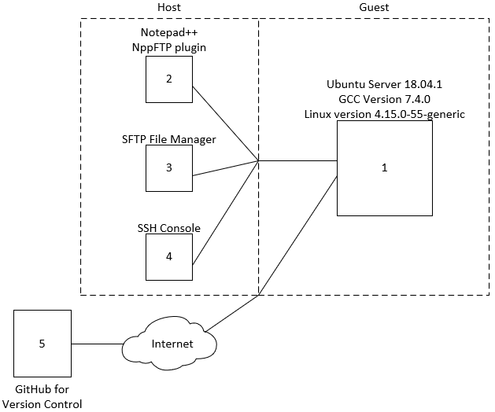

# procedures
alse procedures

procedimientos para entender y configurar el ambiente de programación a utilizar. Este requiere de dos sistemas operativos (OS) uno denominado Guest (invitado) y el OS principal Host como se muestra a continuación.

Las partes del ambiente de programación son:
1.	Sistema operativo para almacenamiento de códigos de programa, conexión con GitHub y proceso de compilación.
2.	Editor de código de programa.
3.	Administrador de archivos para mover y copiar archivos entre guest y host. Opcional.
4.	Consola alternativa para ejecutar procesos de compilación, ejecución y almacenamiendo.
5.	Plataforma para la gestión y el control de versiones.

