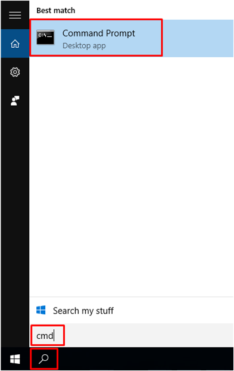
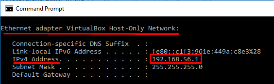

# Comunicación entre el  **_host_** y el **_guest_**

La comunicación entre estos se hace a través de la interfaz lógica de red con dirección IP como se muestra a continuación:

  

**La dirección IP mostrada (192.168.56.1) puede variar de acuerdo a la configuración de red de VirtualBox. Verifiue su dirección IP en el _host_.**
Para verificar esta dirección si el _host_ usa windows:
- Acceder a símbolo de sistema o _cmd_ desde el menú de _inicio_.

  

- Ejecutar el comando _ipconfig_ y buscar la ip del adaptador lógico de red de VirtualBox.

  

