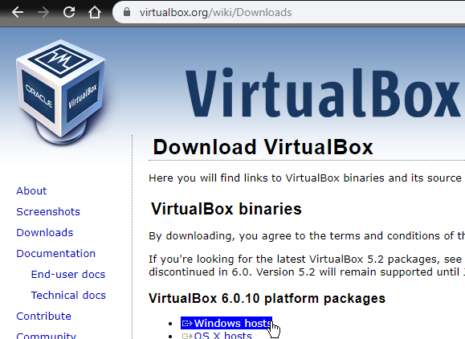
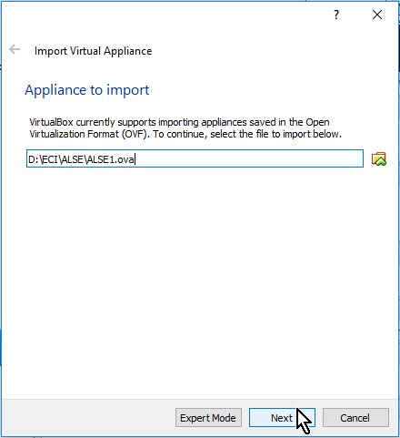
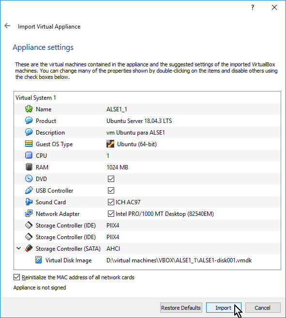
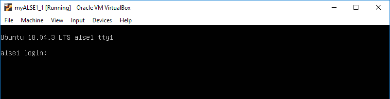
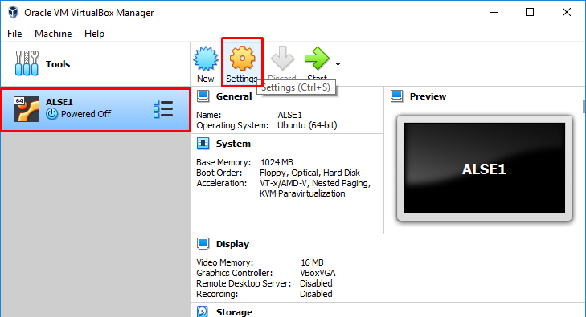

# adecuación de **_Guest_**

	1.	Descargar e instalar [VirtualBox](https://virtualbox.org/wiki/Downloads).

  

2.	Abrir VirtualBox, ir a File y seleccionar la opción correspondiente como se muestra a continuación:

  

3.	Luego, seleccione el archivo ALSE1.ova y haga click en siguiente.

  

4.	Luego, revisar las siguientes opciones, seleccionar la opción para reinicializar las tarjetas de red y click en importar.

  

Una vez finalizado el proceso de importación y luego de iniciar la máquina virtual, ingresar las credenciales asignadas

  

### Configuración de red.
Para permitir la conectividad a internet desde el **_guest_** y al mismo tiempo permitir la comunicación con el **_host_**.

Ir a la configuración de la _máquina virtual_.

  

Seleccionar en la configuración de red la opción NAT para el acceso a internet y luego hacer click en _Port Forwarding_ para configurar la comunicación con el _host_.

  

La configuración de la comunicación con el _host_ se establece a través de la dirección IP de _Host IP_. Ver IP.

  

